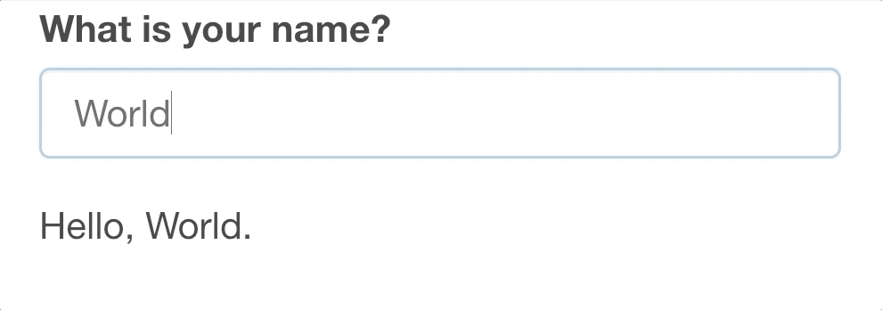
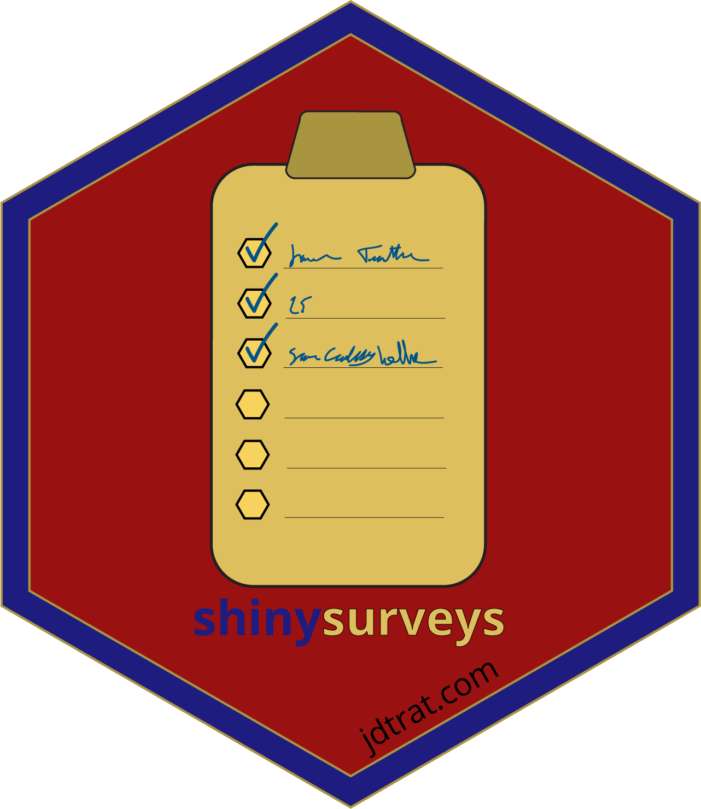

class: inverse center middle

# Senio*R* Thesis

.large[Jonathan Trattner | 05-07-2021]

```{r setup-main, include=FALSE}
options(htmltools.dir.version = FALSE)
library(xaringanExtra)
xaringanExtra::use_xaringan_extra(include = c("tile_view", "editable", "animate_css", "tachyons", "share_again", "fit_screen", "search", "webcam"))
```


```{r meta, echo=FALSE}
library(metathis)
metathis::include_meta(
  meta() %>%
  meta_general(
    description = "",
    generator = "xaringan and remark.js"
  ) %>% 
  meta_social(
    title = "SenioR Thesis",
    url = "",
    image = "",
    image_alt = "",
    og_type = "website",
    og_author = "Jonathan David Trattner",
    twitter_card_type = "summary_large_image",
    twitter_creator = "@jdtrat"
  )
)
```

---
class: inverse center middle

# Hello, World.

???

---
name: theme
layout: true
.my-header[
]

.my-footer[
]

---
class: top
.my-header[
.title[
What is R?
]
]

--

.absolute.left-2.top--1.mt4[
![:r_logo]
]

???
R is a letter. Between Q and S.

--

.relative.top-2.mt5.left-2.ml5.f2.tl.lh-title.pt7[
.relative.top-0.pt3[
is a letter between Q and S.
]
]

???
In computer land, R is what's known as an interpreted, object oriented language. 
A descendent of S, a statistical analysis environment developed at Bell Laboratories -- part of AT&T -- in the 1970s.


---
class: top
.my-header[
.title[
What is R?
]
]

.absolute.left-2.top--1.mt4[
![:r_logo]
]

.relative.top-2.mt5.left-2.ml5.f2.tl.lh-title.pt7[
.relative.top-0.pt3[
is .strike[a letter between Q and S.]
]
]

.relative.left-2.ml5.f2.tl.lh-title[
.relative.left-2.r-color.top-0[an interpreted, .underline[object-oriented] language.]
]

???
In computer land, R is what's known as an interpreted, object oriented language. 
A descendent of S, a statistical analysis environment developed at Bell Laboratories -- part of AT&T -- in the 1970s.

---
class: top center
.my-header[
.title[Why R?
]
]

.mt6.top-2.pt2.f2.lh-title.black.ml0[

.gradient-list.can-edit[
* It's free `r emo::ji("money_mouth_face")`
* It is easily extendible with `r emo::ji("package")`
* It has a vibrant community of use.r-color.b[R]s
]
]

???

First and foremost, R is free unlike some other statistical softwares used in academia like SPSS or Stata. Secondly, it's easily extendible and open source. So, as we will see, anyone can develop a package with code that is easily usable by others. Thirdly, it has a vibrant community of users and developers all of whom are super nice. There's a lot of discussion with people of all skill-levels about how to make R the best for the most people.

Another benefit, not on the slide because I'm going to get into it more, is R's easy integration with other programming languages. So, R itself is derived from the language S, but its creators Ross Ihaka and Robert Gentleman took lots of inspiration from Scheme. A lot of R is actually written in C and C++ to optimize performance, and there a many packages that help users integrate these languages. 

What I'm going to focus on today is R's integration with HTML, CSS, and JavaScript.

---
class: top center
.my-header[
.title[
Talk R 2 Me
]
]


.f2.lh-copy.mt6.tc.bb.bt.br3.bw2.b--green[
Websites are mainly built with three languages.
]

.relative.flex.justify-between.top--2.mt5.tc[

.mr2.column.w-33.ph3.bg-washed-green.dark-gray.b--green.ba.bw1.br3.ph3.pv0.shadow-5[

.center.b[HTML]

.f4[Defines the structure of websites.]
]

.mr2.column.w-33.ph3.bg-washed-green.dark-gray.b--green.ba.bw1.br3.ph3.pv0.shadow-5[
.center.b[CSS]

.f4[Defines the aesthetics of websites.]
]

.mr2.column.w-33.ph3.bg-washed-green.dark-gray.b--green.ba.bw1.br3.ph3.pv0.shadow-5[
.center.b[JavaScript]

.f4[Defines the behavior of websites.]

]
]

---
class: top center
.my-header[
.title[
Talk R 2 Me
]
]


.f2.lh-copy.mt6.tc.bb.bt.br3.bw2.b--green[
Websites are .strike[mainly] .r-color.fw6.f1[] built with .strike[three languages] .r-color.b.f1[].
]


.relative.flex.justify-between.top--2.mt5.tc[

.mr2.column.w-33.ph3.bg-washed-green.dark-gray.b--green.ba.bw1.br3.ph3.pv0.shadow-5[

.center.b[HTML]

.f4[Defines the structure of websites.]
]

.mr2.column.w-33.ph3.bg-washed-green.dark-gray.b--green.ba.bw1.br3.ph3.pv0.shadow-5[
.center.b[CSS]

.f4[Defines the aesthetics of websites.]
]

.mr2.column.w-33.ph3.bg-washed-green.dark-gray.b--green.ba.bw1.br3.ph3.pv0.shadow-5[
.center.b[JavaScript]

.f4[Defines the behavior of websites.]

]
]

---
class: top center
.my-header[
.title[
Talk R 2 Me
]
]

.f2.lh-copy.mt6.tc.bb.bt.br3.bw2.b--green[
Websites are .strike[mainly] .r-color.fw6.f1[] built with .strike[three languages] .r-color.b.f1[].
]

.w-25.relative.pt2.top-1[
![:shiny]
]

.absolute.mt6.left-2.top-0.ml7.pt7.w-60.tl[
Shiny allows users to combine R's computational power with the interactivity of web applications.
]

---
class: top center
.my-header[
.title[
Time to `r emo::ji("sparkles")`shine `r emo::ji("sparkles")`
]
]

```{css, echo = FALSE}

.star-list li {
  list-style: none;
  text-indent: 1rem;
  margin-bottom: 1rem;
}

.star-list li:before {
  content: "🌟";
  margin-right: 1rem;
}
```

.left-0.relative.mt6.pb3.pt2.fw4.measure-center.f1.tl.lh-title.avenir[
"Shiny gives you the ability to pass on some of your .r-color.fw5[R] superpowers to anyone who can use the web."

.tr.right-2.relative.f2.fw3[
\- Hadley Wickham
]
]

???

Why is this important? Well Shiny is used in academia and industry for a whole host of, well, everything. A lot of data analysis pipelines are built with R, where you can connect to a data base, train and run some model, and analyze and visualize your results. 

* Create dashboards that track the model's performance in real time
* Communicate complex materials to non-technical audiences interactive visualizations
* Create demos for teaching statistics or data science concepts

---
class: top center
.my-header[
.title[
Shine bright like a `r emo::ji("gem")`
]
]

.mt6.pt2.tl.ba.br3.shadow-3[

```{r, eval = FALSE}
ui <- fluidPage(
  "Hello, World"
  )

server <- function(input, output, session) {
  
}

shinyApp(ui, server)
```

]

---
class: top center
.my-header[
.title[
Shine bright like a `r emo::ji("gem")`
]
]

.mt6.pt2.tl.ba.br3.shadow-3[

```{r, eval = FALSE}
ui <- fluidPage( #<<
  "Hello, World" #<<
  ) #<<

server <- function(input, output, session) {
  
}

shinyApp(ui, server)
```

]

???

The ui or user-interface which describes what you will actually see

---
class: top center
.my-header[
.title[
Shine bright like a `r emo::ji("gem")`
]
]

.mt6.pt2.tl.ba.br3.shadow-3[

```{r, eval = FALSE}
ui <- fluidPage( 
  "Hello, World"
  ) 

server <- function(input, output, session) { #<<
  #<<
} #<<

shinyApp(ui, server)
```

]

???
The server which describes the logic or rules for what happens when you interact with the application.

---
class: top center
.my-header[
.title[
Shine bright like a `r emo::ji("gem")`
]
]

.mt6.pt2.tl.ba.br3.shadow-3[

```{r, eval = FALSE}
ui <- fluidPage(
  "Hello, World" 
  ) 

server <- function(input, output, session) {
  
}

shinyApp(ui, server) #<<
```

]


???

The command to actually start the application

---
class: top center
.my-header[
.title[
Shine brighter like a `r emo::ji("gem")`
]
]


.tl.f3.mt6.pt2.ba.br3.shadow-3[
```{r, eval = FALSE}

ui <- fluidPage(
  textInput(inputId = "nameInput", 
            label = "What is your name?", 
            value = "World"),
  textOutput("name")
)

server <- function(input, output, session) {
  
  output$name <- renderText({
    paste0("Hello, ", input$nameInput, ".")
    })
}

```
]

???
Now here is a slightly more complicated application. 
---
class: top center
.my-header[
.title[
Shine brighter like a `r emo::ji("gem")`
]
]


.tl.f3.mt6.pt2.ba.br3.shadow-3[
```{r, eval = FALSE}

ui <- fluidPage(
  textInput(inputId = "nameInput", #<<
            label = "What is your name?", 
            value = "World"),
  textOutput("name")
)

server <- function(input, output, session) {
  
  output$name <- renderText({
    paste0("Hello, ", input$nameInput, ".")
    })
}

```
]

???
Now here is a slightly more complicated application. 

In the user-interface, we are defining a text input whose value is tied to the ID "nameInput".

We're specifying that the label should be "What is your name?"

And we're giving it the default value "World"

On the server side, we're specifying the *output* name, as the combination of "Hello, " the input whose value we access with the specific ID, and a ".".

This output ID (name) is then shown to the user


---
class: top center
.my-header[
.title[
Shine brighter like a `r emo::ji("gem")`
]
]


.tl.f3.mt6.pt2.ba.br3.shadow-3[
```{r, eval = FALSE}

ui <- fluidPage(
  textInput(inputId = "nameInput", 
            label = "What is your name?", #<<
            value = "World"),
  textOutput("name")
)

server <- function(input, output, session) {
  
  output$name <- renderText({
    paste0("Hello, ", input$nameInput, ".")
    })
}

```
]

???
Now here is a slightly more complicated application. In the user-interface, we are defining a text input whose value is tied to the ID "nameInput".

We're specifying that the label should be "What is your name?"

And we're giving it the default value "World"

On the server side, we're specifying the *output* name, as the combination of "Hello, " the input whose value we access with the specific ID, and a ".".

This output ID (name) is then shown to the user


---
class: top center
.my-header[
.title[
Shine brighter like a `r emo::ji("gem")`
]
]


.tl.f3.mt6.pt2.ba.br3.shadow-3[
```{r, eval = FALSE}

ui <- fluidPage(
  textInput(inputId = "nameInput", 
            label = "What is your name?", 
            value = "World"), #<<
  textOutput("name")
)

server <- function(input, output, session) {
  
  output$name <- renderText({
    paste0("Hello, ", input$nameInput, ".")
    })
}

```
]

???
Now here is a slightly more complicated application. In the user-interface, we are defining a text input whose value is tied to the ID "nameInput".

We're specifying that the label should be "What is your name?"

And we're giving it the default value "World"

On the server side, we're specifying the *output* name, as the combination of "Hello, " the input whose value we access with the specific ID, and a ".".

This output ID (name) is then shown to the user


---
class: top center
.my-header[
.title[
Shine brighter like a `r emo::ji("gem")`
]
]


.tl.f3.mt6.pt2.ba.br3.shadow-3[
```{r, eval = FALSE}

ui <- fluidPage(
  textInput(inputId = "nameInput", 
            label = "What is your name?", 
            value = "World"),
  textOutput("name")
)

server <- function(input, output, session) {
  
  output$name <- renderText({ #<<
    paste0("Hello, ", input$nameInput, ".") #<<
    }) #<<
}

```
]

???
Now here is a slightly more complicated application. In the user-interface, we are defining a text input whose value is tied to the ID "nameInput".

We're specifying that the label should be "What is your name?"

And we're giving it the default value "World"

On the server side, we're specifying the *output* name, as the combination of "Hello, " the input whose value we access with the specific ID, and a ".".

This output ID (name) is then shown to the user


---
class: top center
.my-header[
.title[
Shine brighter like a `r emo::ji("gem")`
]
]


.tl.f3.mt6.pt2.ba.br3.shadow-3[
```{r, eval = FALSE}

ui <- fluidPage(
  textInput(inputId = "nameInput", 
            label = "What is your name?", 
            value = "World"),
  textOutput("name") #<<
)

server <- function(input, output, session) {
  
output$name <- renderText({ #<<
    paste0("Hello, ", input$nameInput, ".") #<<
    }) #<<
}

```
]

???
Now here is a slightly more complicated application. In the user-interface, we are defining a text input whose value is tied to the ID "nameInput".

We're specifying that the label should be "What is your name?"

And we're giving it the default value "World"

On the server side, we're specifying the *output* name, as the combination of "Hello, " the input whose value we access with the specific ID, and a ".".

This output ID (name) is then shown to the user

---
class: top center
.my-header[
.title[
Shine brighter like a `r emo::ji("gem")`
]
]

.mt6.ba.br3.pt4[

]

???

And when we run this app, it looks something like this. 
The reason I went through some of these steps is to introduce one of the packages I've worked on this year with Dr. McGowan. It utilizes Shiny to create survey forms that can easily be integrated with data collection pipelines built with R. So, without further ado, I would like to show you our package, shinysurveys!

---
class: top center
.my-header[
.title[
shinysurveys
]
]

.mt5.top-2.left-2.absolute.left.pt3[

.pt1[

]
.absolute.right-2.tr.w-50.top-2.mt5.pt4.pr4.f2.tj.mr3[
.underline[shinysurveys] is an easy-to-use, minimalistic package for creating & deploying surveys in R.
]

]
