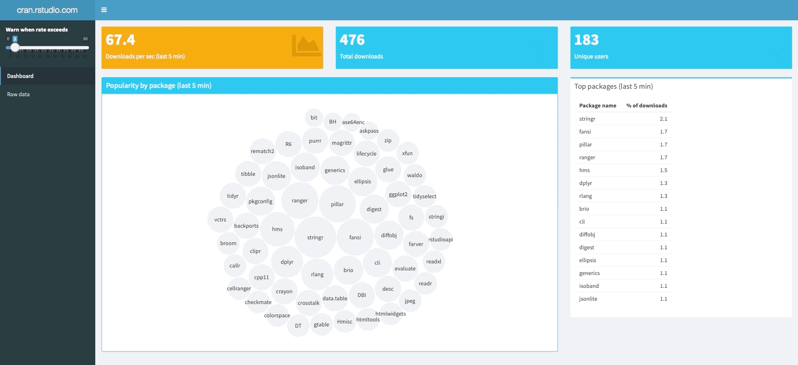
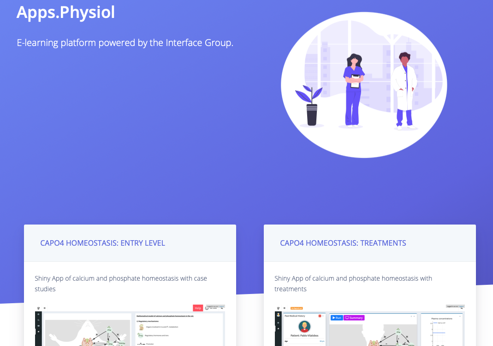

class: inverse center middle

# Senio*R* Thesis

.large[Jonathan Trattner | 05-07-2021]

```{r setup-main, include=FALSE}
options(htmltools.dir.version = FALSE)
library(xaringanExtra)
xaringanExtra::use_xaringan_extra(include = c("tile_view", "editable", "animate_css", "tachyons", "share_again", "fit_screen", "search", "webcam"))
```


```{r meta, echo=FALSE}
library(metathis)
metathis::include_meta(
  meta() %>%
  meta_general(
    description = "",
    generator = "xaringan and remark.js"
  ) %>% 
  meta_social(
    title = "SenioR Thesis",
    url = "",
    image = "",
    image_alt = "",
    og_type = "website",
    og_author = "Jonathan David Trattner",
    twitter_card_type = "summary_large_image",
    twitter_creator = "@jdtrat"
  )
)
```

---
class: inverse center middle

# Hello, World.

???

---
name: theme
layout: true
.my-header[
]

.my-footer[
]

---
class: top
.my-header[
.title[
What is R?
]
]

--

.absolute.left-2.top--1.mt4[
![:r_logo]
]

???
R is a letter. Between Q and S.

--

.relative.top-2.mt5.left-2.ml5.f2.tl.lh-title.pt7[
.relative.top-0.pt3[
is a letter between Q and S.
]
]

???
In computer land, R is what's known as an interpreted, object oriented language. 
A descendent of S, a statistical analysis environment developed at Bell Laboratories -- part of AT&T -- in the 1970s.


---
class: top
.my-header[
.title[
What is R?
]
]

.absolute.left-2.top--1.mt4[
![:r_logo]
]

.relative.top-2.mt5.left-2.ml5.f2.tl.lh-title.pt7[
.relative.top-0.pt3[
is .strike[a letter between Q and S.]
]
]

.relative.left-2.ml5.f2.tl.lh-title[
.relative.left-2.r-color.top-0[an interpreted, .underline[object-oriented] language.]
]

???
In computer land, R is what's known as an interpreted, object oriented language. 
A descendent of S, a statistical analysis environment developed at Bell Laboratories -- part of AT&T -- in the 1970s.

---
class: top center gradient-list
.my-header[
.title[Why R?
]
]

--

.mt6.top-2.pt2.f2.lh-title.black.ml0[
* It's free `r emo::ji("money_mouth_face")`
]

???

First and foremost, R is free unlike some other statistical softwares used in academia like SPSS or Stata.

--

.relative.f2.lh-title.black.ml0[
* It is easily extendible with `r emo::ji("package")`
]

???

Secondly, it's easily extendible and open source. So, as we will see, anyone can develop a package with code that is easily usable by others.

--

.relative.f2.lh-title.black.ml0[
* It has a vibrant community of use.r-color.b[R]s
]

???

Thirdly, it has a vibrant community of users and developers all of whom are super nice. There's a lot of discussion with people of all skill-levels about how to make R the best for the most people.

Another benefit, not on the slide because I'm going to get into it more, is R's easy integration with other programming languages. So, R itself is derived from the language S, but its creators Ross Ihaka and Robert Gentleman took lots of inspiration from Scheme. A lot of R is actually written in C and C++ to optimize performance, and there a many packages that help users integrate these languages. 

What I'm going to focus on today is R's integration with HTML, CSS, and JavaScript.

---
class: top center
.my-header[
.title[
Talk R 2 Me
]
]


.f2.lh-copy.mt6.tc.bb.bt.br3.bw2.b--green[
Websites are mainly built with three languages.
]

.relative.flex.justify-between.top--2.mt5.tc[

.mr2.column.w-33.ph3.bg-washed-green.dark-gray.b--green.ba.bw1.br3.ph3.pv0.shadow-5[

.center.b[HTML]

.f4[Defines the structure of websites.]
]

.mr2.column.w-33.ph3.bg-washed-green.dark-gray.b--green.ba.bw1.br3.ph3.pv0.shadow-5[
.center.b[CSS]

.f4[Defines the aesthetics of websites.]
]

.mr2.column.w-33.ph3.bg-washed-green.dark-gray.b--green.ba.bw1.br3.ph3.pv0.shadow-5[
.center.b[JavaScript]

.f4[Defines the behavior of websites.]

]
]

---
class: top center
.my-header[
.title[
Talk R 2 Me
]
]


.f2.lh-copy.mt6.tc.bb.bt.br3.bw2.b--green[
Websites are .strike[mainly] .r-color.fw6.f1[] built with .strike[three languages] .r-color.b.f1[].
]


.relative.flex.justify-between.top--2.mt5.tc[

.mr2.column.w-33.ph3.bg-washed-green.dark-gray.b--green.ba.bw1.br3.ph3.pv0.shadow-5[

.center.b[HTML]

.f4[Defines the structure of websites.]
]

.mr2.column.w-33.ph3.bg-washed-green.dark-gray.b--green.ba.bw1.br3.ph3.pv0.shadow-5[
.center.b[CSS]

.f4[Defines the aesthetics of websites.]
]

.mr2.column.w-33.ph3.bg-washed-green.dark-gray.b--green.ba.bw1.br3.ph3.pv0.shadow-5[
.center.b[JavaScript]

.f4[Defines the behavior of websites.]

]
]

---
class: top center
.my-header[
.title[
Talk R 2 Me
]
]

.f2.lh-copy.mt6.tc.bb.bt.br3.bw2.b--green[
Websites are .strike[mainly] .r-color.fw6.f1[] built with .strike[three languages] .r-color.b.f1[].
]

.w-25.relative.pt2.top-1[
![:shiny]
]

.absolute.mt6.left-2.top-0.ml7.pt7.w-60.tl[
Shiny allows users to combine R's computational power with the interactivity of web applications.
]

---
class: top center
.my-header[
.title[
Time to `r emo::ji("sparkles")`shine `r emo::ji("sparkles")`
]
]

```{css, echo = FALSE}

.star-list li {
  list-style: none;
  text-indent: 1rem;
  margin-bottom: 1rem;
}

.star-list li:before {
  content: "🌟";
  margin-right: 1rem;
}
```

.left-0.relative.mt6.pb3.pt2.fw4.measure-center.f1.tl.lh-title.avenir[
"Shiny gives you the ability to pass on some of your .r-color.fw5[R] superpowers to anyone who can use the web."

.tr.right-2.relative.f2.fw3[
\- Hadley Wickham
]
]

.footnote[
[Mastering Shiny by Hadley Wickham, 2020](https://mastering-shiny.org/preface.html)
]


???

Why is this important? Well Shiny is used in academia and industry for a whole host of, well, everything. A lot of data analysis pipelines are built with R, where you can connect to a data base, train and run some model, and analyze and visualize your results. 

---
class: top center
.my-header[
.title[
Oooh, `r emo::ji("sparkles")`shiny `r emo::ji("sparkles")`
]
]

.mt6[

]

.footnote[
[Developed by Joe Cheng & Colleagues, RStudio](https://github.com/rstudio/shiny-examples/tree/master/087-crandash)
]

???

* Create dashboards that track data and/or model metrics in real time

---
class: top center
.my-header[
.title[
Oooh, `r emo::ji("sparkles")`shiny `r emo::ji("sparkles")`
]
]

.mt5.pt2[

]

.footnote[
[Developed by David Granjon, The Interface Group](https://shiny.rstudio.com/gallery/teach-physiology.html)
]

???

* Create demos for teaching complex materials

---
class: top center
.my-header[
.title[
Oooh, `r emo::ji("sparkles")`shiny `r emo::ji("sparkles")`
]
]

.mt6.pt1[

]

.footnote[
[Developed by Hao Zhuname](https://shiny.rstudio.com/gallery/mri-images.html)
]

???

* Visualize MRI data

---
class: top center
.my-header[
.title[
Shine bright like a `r emo::ji("gem")`
]
]

.mt6.pt2.tl.ba.br3.shadow-3[

```{r, eval = FALSE}
ui <- fluidPage(
  "Hello, World"
  )

server <- function(input, output, session) {
  
}

shinyApp(ui, server)
```

]

---
class: top center
.my-header[
.title[
Shine bright like a `r emo::ji("gem")`
]
]

.mt6.pt2.tl.ba.br3.shadow-3[

```{r, eval = FALSE}
ui <- fluidPage( #<<
  "Hello, World" #<<
  ) #<<

server <- function(input, output, session) {
  
}

shinyApp(ui, server)
```

]

???

The ui or user-interface which describes what you will actually see

---
class: top center
.my-header[
.title[
Shine bright like a `r emo::ji("gem")`
]
]

.mt6.pt2.tl.ba.br3.shadow-3[

```{r, eval = FALSE}
ui <- fluidPage( 
  "Hello, World"
  ) 

server <- function(input, output, session) { #<<
  #<<
} #<<

shinyApp(ui, server)
```

]

???
The server which describes the logic or rules for what happens when you interact with the application.

---
class: top center
.my-header[
.title[
Shine bright like a `r emo::ji("gem")`
]
]

.mt6.pt2.tl.ba.br3.shadow-3[

```{r, eval = FALSE}
ui <- fluidPage(
  "Hello, World" 
  ) 

server <- function(input, output, session) {
  
}

shinyApp(ui, server) #<<
```

]


???

The command to actually start the application

---
class: top center
.my-header[
.title[
shinysurveys
]
]

.mt5.top-2.left-2.absolute.left.pt3[

.pt1[

]
.absolute.right-2.tr.w-50.top-2.mt5.pt4.pr4.f2.tj.mr3[
.underline[shinysurveys] is an easy-to-use, minimalistic package for creating & deploying surveys in R.
]

]

---
class: center gradient-list
.my-header[
.title[
Why shinysurveys?
]
]

.mt5.pt5[
- Surveys are used across disciplines to gather information
]


???

The overarching theme of my thesis was to develop software that would help professionals, in academia and industry, utilize R more effectively. And a specific focus was for behavioral data collection, which I have been involved with conducting neuroscience research.


Surveys are extremely useful tools for gathering information from individuals on a large scale, and they are widely used in a variety of domains.

--

.sub-gradient-list[
- Correlate behaviors with `r emo::ji("brain")` `r emo::ji("camera")` data.
- Epidemiological questionnaires `r emo::ji("clipboard")`
]

???

 My neuroscience research lab, for example, has used surveys in the past to correlate behaviors such as political ideology with nueroimaging data. Within the medical field, there are many epidemiological questionnaires, such as did you get your Covid-19 vaccine?

--

.relative[
- Existing survey tools don't always integrate well with data analysis pipelines
]


???

So the ability to easily collect and analyze data is important. Google Forms, SurveyMonkey, Qualtrics, all exist for this purpose, but they often don't integrate with existing data analysis or research pipelines. 

As I mentioned, R has become an extremely popular language and so, with the help of Dr. McGowan, we designed {shinysurveys} to streamline this data collection and analysis process.

Well, those of you who were here for Nuri's talk a few minutes ago, might recall the use of a survey module to collect demographic information. That was actually done using {shinysurveys}. 

There's a huge number of applications for our package, and today I'm just going to highlight some of the key design features of it, technical challenges, and next steps.

---
class: top center
.my-header[
.title[
shhinysurveys
]
]

.tl.f3.mt6.pt1.ba.br3.shadow-3[
```{r, eval = FALSE}
library(shinysurveys)

ui <- fluidPage(
  surveyOutput()
)

server <- function(input, output, session) {
 renderSurvey() 
}
```
]

???
Recalling the basic structure of a shiny application, the user-interface and the server, our package provides two functions. One for each component.

---
class: top center
.my-header[
.title[
shhinysurveys
]
]

.tl.f3.mt6.pt1.ba.br3.shadow-3[
```{r, eval = FALSE}
library(shinysurveys)

ui <- fluidPage(
  surveyOutput(df = questions, #<<
               survey_title = "Hello, World!", #<<
               survey_description = "A demo survey") #<<
)

server <- function(input, output, session) {
   renderSurvey(df = questions, 
              theme = "#63B8FF")
}
```
]

???
In the ui component, you call surveyOutput, which takes in a data frame of questions, and an optional title or description.


---
class: top center
.my-header[
.title[
shhinysurveys
]
]

.tl.f3.mt6.pt1.ba.br3.shadow-3[
```{r, eval = FALSE}
library(shinysurveys)

ui <- fluidPage(
  surveyOutput(df = questions,
               survey_title = "Hello, World!",
               survey_description = "A demo survey")
)

server <- function(input, output, session) {
   renderSurvey(df = questions, #<<
              theme = "#63B8FF") #<<
}
```
]

???
In the server component, you call renderSurvey(), which takes in the same data frame of questions, and an optional theme color.

---
class: top center
.my-header[
.title[
shinysurveys
]
]

```{r create-questions-df, echo = FALSE}

colors <-c("#f69f8c",
           "#f6d48c",
           "#e3f68c",
           "#aef68c",
           "#8cf69f",
           "#8cf6d4",
           "#f69f8c")

library(kableExtra)
questions <- data.frame(question = "What is your favorite food?",
                 option = NA,
                 input_type = "text",
                 input_id = "favorite_food",
                 dependence = NA,
                 dependence_value = NA,
                 required = F) %>%
  dplyr::rename_with(snakecase::to_title_case)

questions_table <- kableExtra::kable(questions, 'html') %>%
  kable_paper() %>%
  row_spec(0, bold = TRUE, font_size = "large", underline = TRUE, color = "black", align = "c", ) %>%
  row_spec(1, align = "c", bold = TRUE) %>%
  column_spec(1, width = "50em") %>%
  column_spec(2:7, width = "36em") %>%
  column_spec(c(2,5,6), color = "red")
```

.mt6[
```{r, echo = FALSE}
questions_table
```
]

???
Now I've been talking about this data frame of questions, what does that mean? 

---
class: top center
.my-header[
  .title[
    shinysurveys
  ]
]

.mt6[
```{r, echo = FALSE}
  questions_table %>%
    column_spec(1, background = '#f69f8c', color = 'black', bold = FALSE)
```
]

```{css, echo = FALSE}
.remark-slide-content {
  padding: 1em 2em 1em 2em;
}
.box-color {background-color: #eee;}
```

.tc.ph3.ba.bw1.br3.relative.mt3.black.b--gray.shadow-4.box-color[

The question to be asked.

]

---
class: top center
.my-header[
  .title[
    shinysurveys
  ]
]

.mt6[
```{r, echo = FALSE}
  questions_table %>%
    column_spec(2, background = '#f6d48c', color = 'black', bold = FALSE)
```
]

```{css, echo = FALSE}
.remark-slide-content {
  padding: 1em 2em 1em 2em;
}
.box-color {background-color: #eee;}
```

.tc.ph3.ba.bw1.br3.relative.mt3.black.b--gray.shadow-4.box-color[

A possible response to the question.

]


???

In multiple choice questions, for example, this would be the possible answers. For questions without discrete answers, such as a numeric input, this would be the default option shown on the input. For text inputs, like this one, it is the placeholder value. We can also have it as an NA, meaning no value, and the package will automatically add a placeholder of quote-on-quote "Placeholder."

---
class: top center
.my-header[
  .title[
    shinysurveys
  ]
]

.mt6[
```{r, echo = FALSE}
  questions_table %>%
    column_spec(3, background = '#e3f68c', color = 'black', bold = FALSE)
```
]

```{css, echo = FALSE}
.remark-slide-content {
  padding: 1em 2em 1em 2em;
}
.box-color {background-color: #eee;}
```

.tc.ph3.ba.bw1.br3.relative.mt3.black.b--gray.shadow-4.box-color[

What type of response is expected? Numeric? Multiple choice? Text?

]

---
class: top center
.my-header[
  .title[
    shinysurveys
  ]
]

.mt6[
```{r, echo = FALSE}
  questions_table %>%
    column_spec(4, background = '#aef68c', color = 'black', bold = FALSE)
```
]

```{css, echo = FALSE}
.remark-slide-content {
  padding: 1em 2em 1em 2em;
}
.box-color {background-color: #eee;}
```

.tc.ph3.ba.bw1.br3.relative.mt3.black.b--gray.shadow-4.box-color[

A unique identifier that allows the Shiny server to identify the input.

]

---
class: top center
.my-header[
  .title[
    shinysurveys
  ]
]

.mt6[
```{r, echo = FALSE}
  questions_table %>%
    column_spec(5, background = '#8cf69f', color = 'black', bold = FALSE)
```
]

```{css, echo = FALSE}
.remark-slide-content {
  padding: 1em 2em 1em 2em;
}
.box-color {background-color: #eee;}
```

.tc.ph3.ba.bw1.br3.relative.mt3.black.b--gray.shadow-4.box-color[

The input id of the question this depends upon. 

]

???
Should this question only appear if a different one has a specific value?

---
class: top center
.my-header[
  .title[
    shinysurveys
  ]
]

.mt6[
```{r, echo = FALSE}
  questions_table %>%
    column_spec(6, background = '#8cf6d4', color = 'black', bold = FALSE)
```
]

```{css, echo = FALSE}
.remark-slide-content {
  padding: 1em 2em 1em 2em;
}
.box-color {background-color: #eee;}
```

.tc.ph3.ba.bw1.br3.relative.mt5.black.b--gray.shadow-4.box-color[

The value of the dependent question that triggers this one to be shown.

]

---
class: top center
.my-header[
  .title[
    shinysurveys
  ]
]

.mt6[
```{r, echo = FALSE}
  questions_table %>%
    column_spec(7, background = '#f69f8c', color = 'black', bold = FALSE)
```
]

```{css, echo = FALSE}
.remark-slide-content {
  padding: 1em 2em 1em 2em;
}
.box-color {background-color: #eee;}
```

.tc.ph3.ba.bw1.br3.relative.mt5.black.b--gray.shadow-4.box-color[

Should the question be required? .i[`TRUE`] or .i[`FALSE`].

]

---
class: top center
.my-header[
  .title[
    shinysurveys
  ]
]


https://bit.ly/3tkosOb


???

One of the benefits of our package is that you can store surveys as a csv or excel spreadsheet that can be read into R and create a survey. So, if one wanted to create a survey asking about your favorite food, we could do so with a csv like the table on the last slide. Now, what does a survey like this look like? Well, https://bit.ly/3tkosOb
